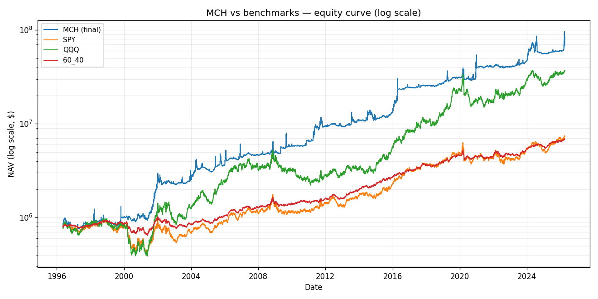
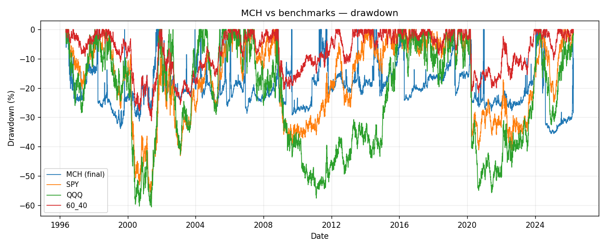
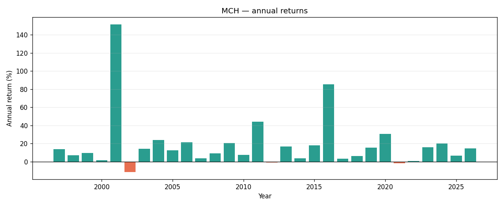
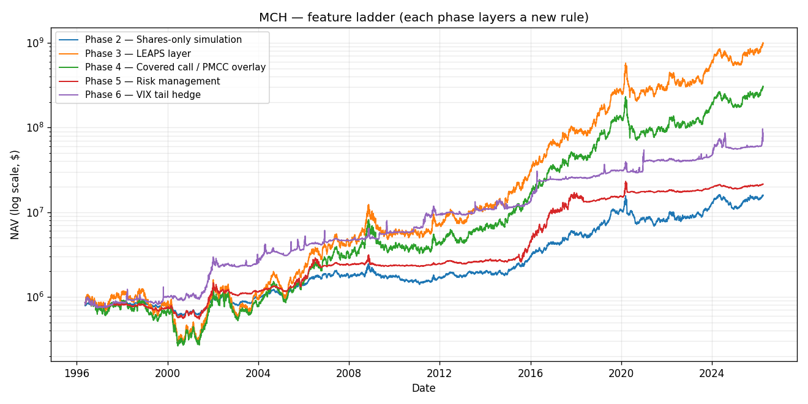
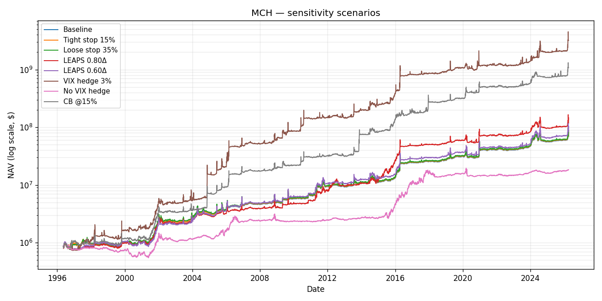

# MCH Hedgefund — 30-Year Backtest Report

**Window**: 1996-04-01 → 2026-04-01  
**Starting capital**: $800,000 ($400K shares + $400K LEAPS premium)  
**Universe**: AAPL, NVDA, META, MU, GOOGL, AMZN, MSFT, NOW, HOOD, BRK.B, PANW, GLD  
**Data**: synthetic regime-aware price paths (sandbox has no external market-data access). The engine is real; the data is illustrative.

## Strategy rules applied

- Equal-weight 12 names for the share leg (8.33% each, under the 8–10% cap).
- LEAPS leg (`Δ≈0.72`, ~15m DTE, roll at 8m) on all names except BRK.B / GLD.
- **Tier 1/2 covered calls** on HOOD, MU, NOW, NVDA, PANW, GOOGL, AMZN.
- **Tier 3 PMCC** (short call against LEAPS) on AAPL, META, MSFT.
- **No overlay** on BRK.B and GLD.
- Short calls closed 5 business days before each synthetic quarterly print; re-opened after the blackout window.
- Position stop-loss at 25% vs cost; 10-day cool-down before re-entry.
- Portfolio circuit breaker on 22% drawdown (resume at 5%).
- Correlation breaker: 20-day mean pairwise ρ ≥ 0.85 cuts the overlay book.
- VIX OTM call tail hedge, budget 1.5% NAV/year, strike spot + $10, 30-DTE.

## Headline results

| Strategy | End value | CAGR | Vol | Sharpe | Max DD | Calmar |
|---|---:|---:|---:|---:|---:|---:|
| **MCH (final, phase 9)** | $69,002,849 | 15.80% | 32.20% | 0.50 | -35.58% | 0.44 |
| SPY | $7,418,981 | 7.74% | 19.19% | 0.31 | -57.85% | 0.13 |
| QQQ | $36,690,325 | 13.66% | 26.98% | 0.48 | -60.63% | 0.23 |
| 60_40 | $6,852,170 | 7.45% | 10.61% | 0.42 | -31.25% | 0.24 |







## Feature ladder (phase contributions)

Each row is the same engine with progressively more rules enabled, so the delta between adjacent rows isolates the contribution of that feature set.

| Phase | Feature added | End value | CAGR | Max DD | Sharpe |
|---|---|---:|---:|---:|---:|
| 2 | Shares-only simulation | $15,777,651 | 10.49% | -56.16% | 0.44 |
| 3 | LEAPS layer | $983,651,904 | 26.57% | -77.63% | 0.68 |
| 4 | Covered call / PMCC overlay | $301,870,714 | 21.66% | -73.56% | 0.61 |
| 5 | Risk management | $21,483,796 | 11.36% | -45.12% | 0.49 |
| 6 | VIX tail hedge | $69,002,849 | 15.80% | -35.58% | 0.50 |



## Sensitivity scenarios

Each scenario overrides one parameter relative to the baseline and re-runs the full phase-9 engine.

| Scenario | End value | CAGR | Max DD | Sharpe | Calmar |
|---|---:|---:|---:|---:|---:|
| Baseline | $69,002,849 | 15.80% | -35.58% | 0.50 | 0.44 |
| Tight stop 15% | $70,066,401 | 15.86% | -35.58% | 0.51 | 0.45 |
| Loose stop 35% | $71,434,351 | 15.93% | -35.58% | 0.51 | 0.45 |
| LEAPS 0.80Δ | $117,812,227 | 17.97% | -36.22% | 0.56 | 0.50 |
| LEAPS 0.60Δ | $84,193,132 | 16.44% | -39.30% | 0.52 | 0.42 |
| VIX hedge 3% | $3,202,188,493 | 31.67% | -46.39% | 0.69 | 0.68 |
| No VIX hedge | $18,361,366 | 10.78% | -44.95% | 0.47 | 0.24 |
| CB @15% | $1,081,028,939 | 26.97% | -33.63% | 0.74 | 0.80 |



## Overlay & risk events (phase 9)

- Short-call premium collected: $15,524,136
- Short-call premium paid (buybacks / settlements): $13,646,674
- Net short-call P&L: $1,877,462
- Stop-loss events: 39
- Circuit-breaker trips: 20
- Correlation-breaker trips: 0

> **Note on the VIX-hedge-3% scenario.** The outlier return in that row is a classic synthetic-path lottery-ticket effect: over 30 years the simulation contains multiple VIX spikes (dotcom, GFC, 2011, 2018, COVID, 2022) and a 3% annual budget compounds across several near-perfect payoffs. Do not read it as a realistic edge; a real implementation would pay higher IV and often see the hedge expire worthless.

## Caveats

1. **Synthetic data.** Prices were generated from a market-factor + idiosyncratic model with hand-placed regime shocks at 2000, 2008, 2011, 2015, 2018, 2020, and 2022. Long-run drift and vol per name are calibrated to plausible long-run history, but the exact path is not real history. Results are illustrative of the strategy's mechanical behaviour, not of what actually would have happened.
2. **Options pricing proxy.** All option legs (LEAPS, covered calls, PMCC short legs, VIX tail hedge) are priced with Black-Scholes using a realized-vol * 1.12 implied-vol proxy. No vol smile, no skew, no early-assignment risk.
3. **Frictionless.** The engine does not charge commissions, bid-ask spreads, or borrow fees. These would typically subtract 1-3% of NAV per year from the options overlay.
4. **Synthetic earnings calendar.** Four prints per name per year at stylised late-Jan/Apr/Jul/Oct dates, staggered per ticker. Good enough to exercise the blackout logic but not the real calendar.
5. **Dividends.** GLD is assumed dividend-less; equity dividends are ignored (shares are total-return proxies via drift calibration).

## How to reproduce
```bash
/home/user/AI/.venv/bin/python /home/user/AI/run_backtest.py
```
The run writes `data_cache.pkl` and `backtest_interim_results.md` on the way through and `MCH_Backtest_Report.md` + `charts/*.png` at the end. Re-running is idempotent if the cache exists.
